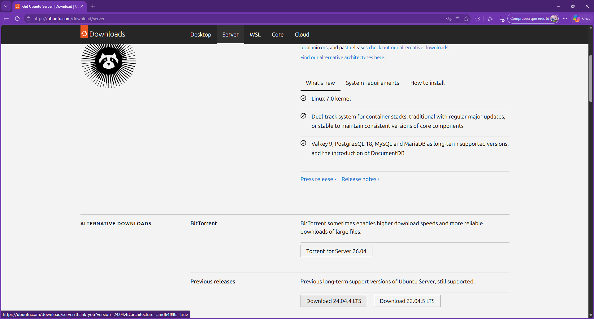

# Wiki de Linux Server

## Estudiante

**Patricia Riveros Estay**

## Objetivo

El objetivo de este proyecto es documentar la instalación, configuración y administración de un servidor Ubuntu Server mediante línea de comandos.

Durante el laboratorio se trabajó con una máquina virtual creada en VirtualBox, configurada con red NAT, acceso remoto mediante SSH y publicación de un sitio web utilizando nginx.

La documentación se organizó en archivos Markdown y se complementó con capturas de cada procedimiento realizado.

---

## Herramientas utilizadas

### VirtualBox

VirtualBox se utilizó para crear y ejecutar la máquina virtual donde se instaló Ubuntu Server.


La máquina virtual permite trabajar con Linux dentro del computador sin modificar el sistema operativo principal.

### Ubuntu Server 24.04 LTS

Se descargó la imagen ISO de Ubuntu Server 24.04 LTS desde el sitio oficial de Ubuntu.



Esta versión se utilizó para instalar el sistema operativo del servidor.

---

## Topología del laboratorio

El laboratorio utiliza una sola máquina virtual llamada:

```text
srv-wiki
```

La configuración de red se realizó de la siguiente forma:

```text
Computador anfitrión
        |
        |-- SSH: localhost:2222
        |          ↓
        |       puerto 22
        |
        |-- Web: localhost:8080
                   ↓
                puerto 80

Máquina virtual Ubuntu Server
Red NAT
```

La red NAT permite que Ubuntu Server utilice la conexión a internet del computador anfitrión.

El reenvío de puertos permite:

- Administrar el servidor mediante SSH usando el puerto `2222`.
- Acceder al sitio publicado con nginx usando el puerto `8080`.

---

## Estructura de la documentación

La wiki se divide en los siguientes apartados:

- Software libre y licencias.
- Instalación y configuración básica.
- Gestión de archivos y permisos.
- Gestores de paquetes.
- Nginx y despliegue web.
- Bitácora de uso de Inteligencia Artificial.

Cada sección contiene una explicación del procedimiento, los comandos utilizados y las capturas que demuestran su ejecución.

---

## Resultado esperado

Al finalizar el proyecto se contará con:

- Ubuntu Server instalado en VirtualBox.
- Acceso remoto mediante SSH.
- Sistema actualizado y protegido con UFW.
- Gestión de archivos, propietarios y permisos.
- Uso del gestor de paquetes `apt`.
- Servidor nginx activo.
- Sitio web publicado desde la máquina virtual.
- Wiki React publicada en GitHub y Vercel.
