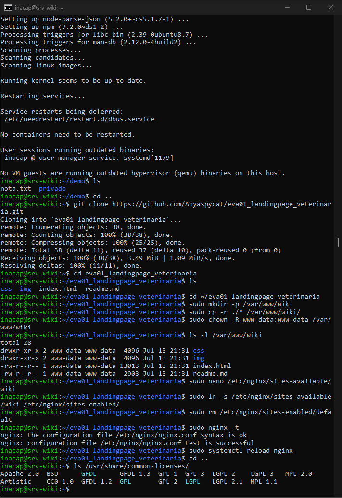
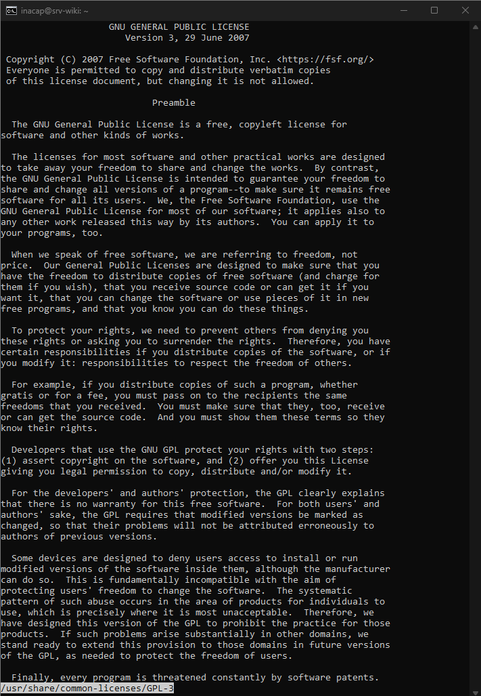
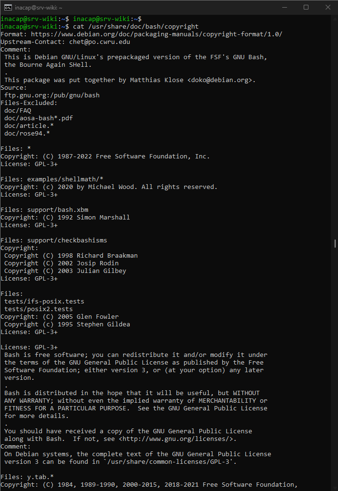

# Software libre y licencias

## Objetivo

Reconocer distintos tipos de licencias de software y relacionarlos con Ubuntu Server y algunas herramientas utilizadas durante el laboratorio.

---

## 1. Licencias disponibles en Ubuntu

Se ejecutó:

```bash
ls /usr/share/common-licenses/
```



El sistema mostró licencias como GPL, LGPL, BSD, Apache y MPL. Esto confirma que Ubuntu incluye software distribuido bajo distintos tipos de licenciamiento.

---

## 2. Licencia GPL

Se revisó la licencia GPL versión 3 mediante:

```bash
less /usr/share/common-licenses/GPL-3
```



La GPL es una licencia de software libre con copyleft. Permite usar, estudiar, modificar y distribuir el software, pero exige mantener la misma licencia en las versiones derivadas.

---

## 3. Licencia de Bash

Se consultó la información del paquete Bash:

```bash
cat /usr/share/doc/bash/copyright
```



La salida indicó que Bash se distribuye principalmente bajo GPL-3 o una versión posterior. Esto permite relacionar una licencia real con una herramienta incluida en Ubuntu Server.

---

## Tipos de licenciamiento

### Software libre con copyleft

Licencias como GPL permiten usar, estudiar, modificar y distribuir el programa. Las versiones modificadas deben conservar las mismas libertades.

### Licencias permisivas

Licencias como MIT, BSD y Apache permiten reutilizar y modificar el software con menos restricciones. Generalmente exigen conservar los avisos de autoría y licencia.

### Software propietario

El código fuente no suele estar disponible y su uso, modificación o distribución depende de las condiciones definidas por el propietario.

---

## Relación con las herramientas utilizadas

- **Ubuntu Server:** distribución compuesta principalmente por software libre y paquetes con distintas licencias.
- **Bash:** distribuido bajo GPL-3 o posterior.
- **nginx:** utiliza una licencia permisiva de tipo BSD.
- **VirtualBox:** combina componentes de software libre con extensiones sujetas a otras condiciones de licencia.

---

## Resultado

Al finalizar esta etapa se logró:

- Identificar licencias instaladas en Ubuntu.
- Revisar el contenido de la GPL versión 3.
- Relacionar Bash con su licencia.
- Diferenciar copyleft, licencias permisivas y software propietario.
- Relacionar el licenciamiento con las herramientas utilizadas.

Con esto se completó el criterio 3.1.1 de software libre y licencias.
