# Instalación y configuración básica de Ubuntu Server

## Objetivo

Crear una máquina virtual con Ubuntu Server 24.04 LTS, configurarla en red NAT, habilitar el acceso por SSH, actualizar el sistema y activar el firewall UFW.

---

## 1. Creación de la máquina virtual

Se creó la máquina virtual `SRV-WIKI` en VirtualBox utilizando la ISO de Ubuntu Server 24.04 LTS.

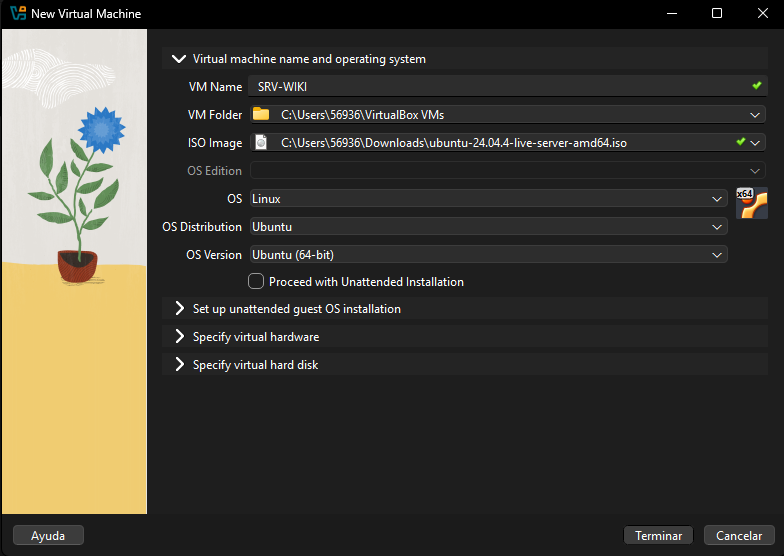

Se asignaron 2048 MB de RAM y 2 procesadores.

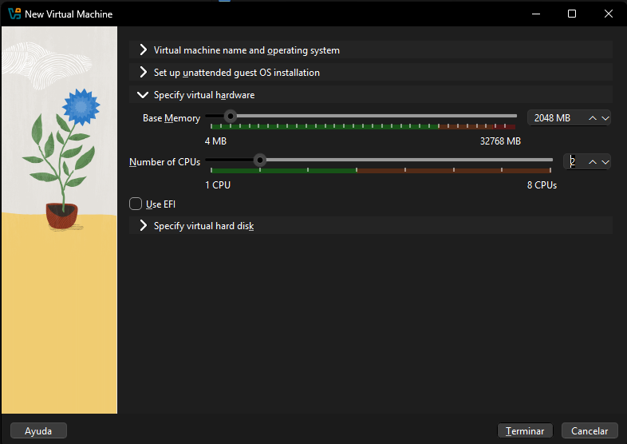

También se creó un disco virtual VDI de 25 GB.

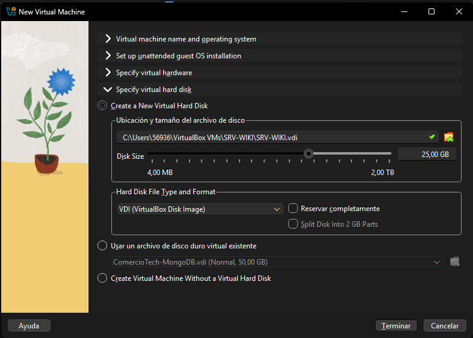

---

## 2. Configuración de red

El adaptador de red se configuró en modo NAT para permitir que la máquina virtual utilizara la conexión a internet del computador anfitrión.

Se agregaron estas reglas de reenvío de puertos:

- `2222 → 22` para SSH.
- `8080 → 80` para el sitio web.

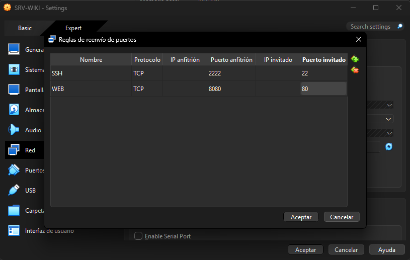

Durante la instalación, la interfaz `enp0s3` recibió por DHCP la dirección `10.0.2.15/24`.

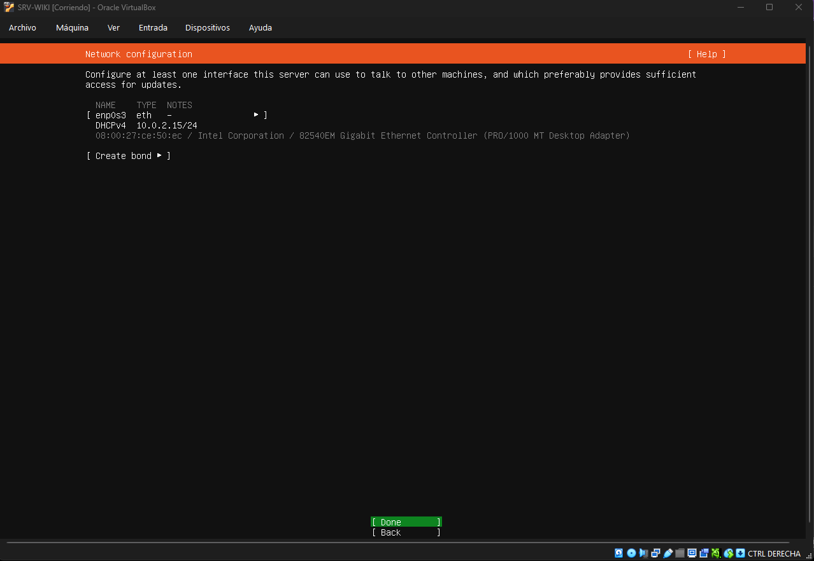

---

## 3. Instalación de Ubuntu Server

Durante la instalación se habilitó OpenSSH Server para permitir la administración remota.

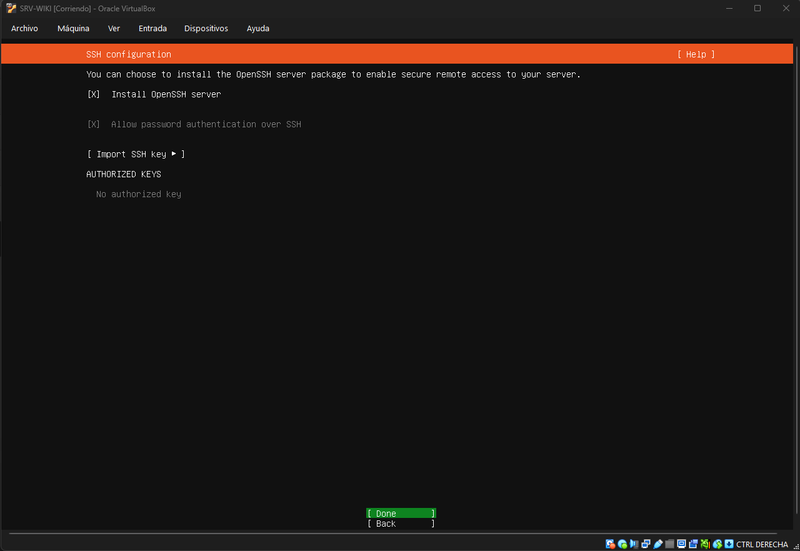

Luego se completó la instalación y se reinició la máquina virtual.

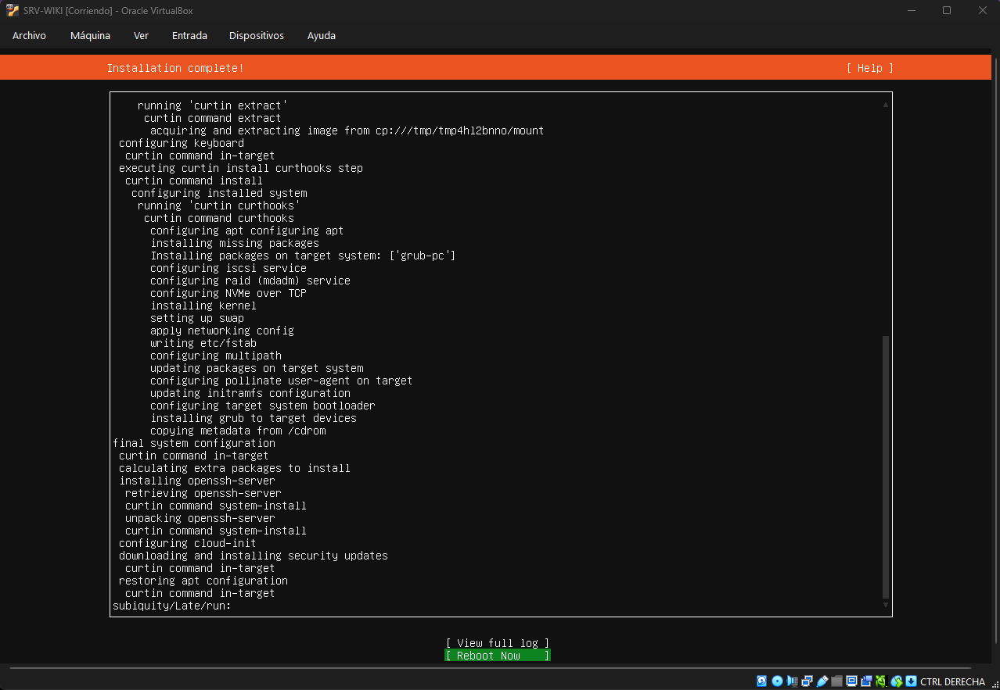

Después del reinicio se inició sesión con el usuario `inacap`.

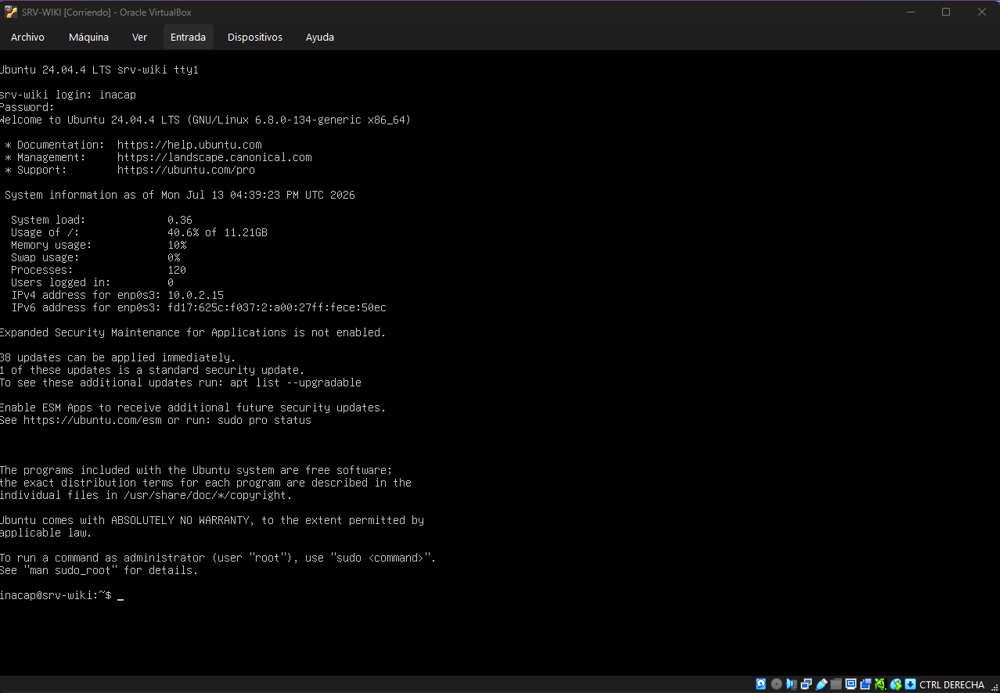

---

## 4. Conexión remota por SSH

Desde Windows se ejecutó:

```bash
ssh -p 2222 inacap@localhost
```

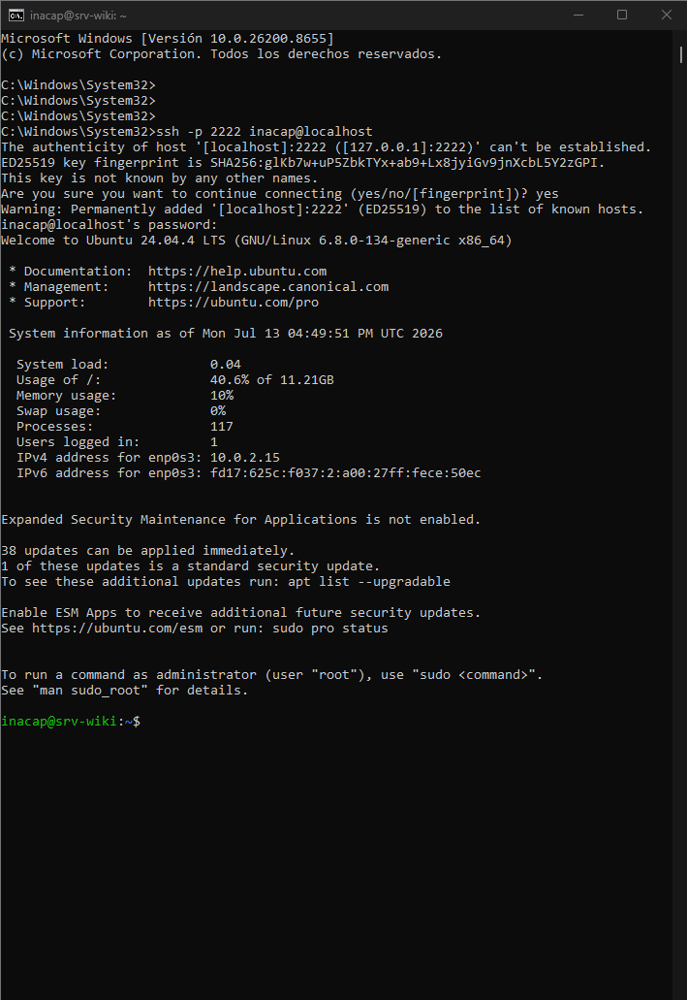

La conexión fue exitosa y permitió administrar el servidor desde la terminal de Windows.

---

## 5. Verificación del hostname

Se ejecutó:

```bash
hostnamectl
```

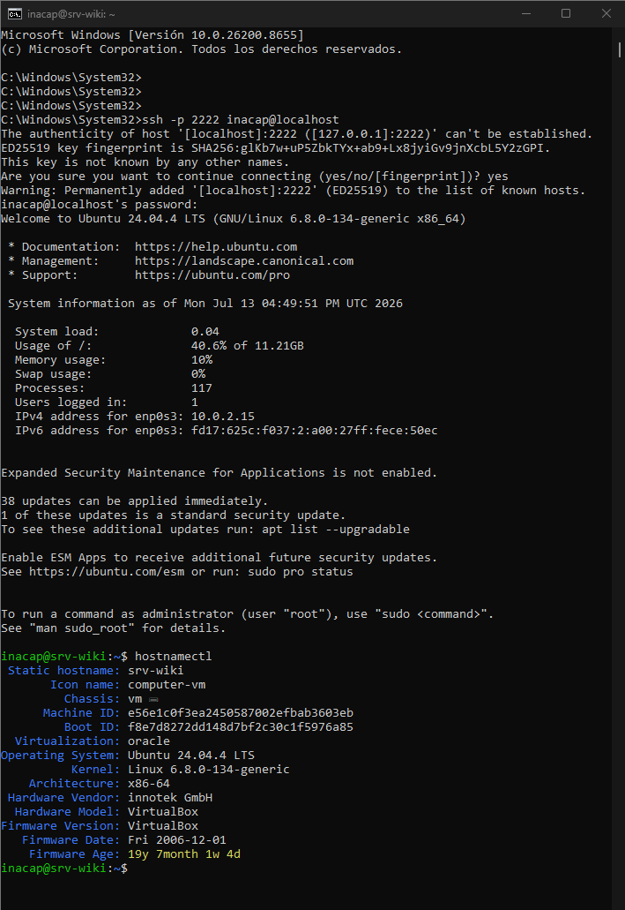

El resultado confirmó:

```text
Static hostname: srv-wiki
Operating System: Ubuntu 24.04.4 LTS
```

---

## 6. Verificación de la dirección IP

Se ejecutó:

```bash
ip a
```

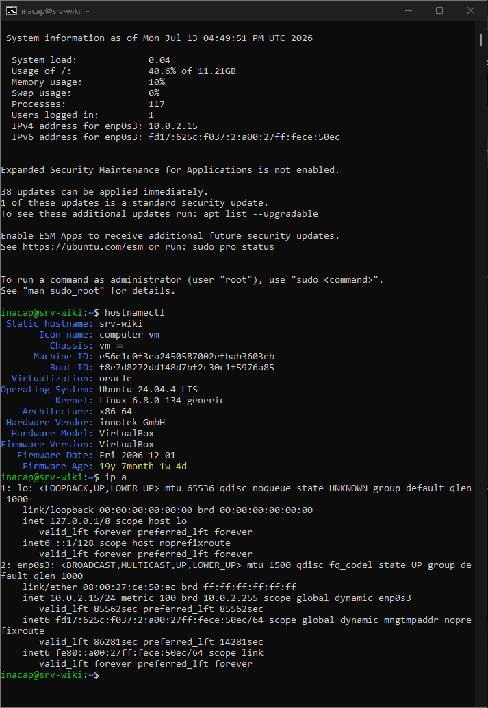

La interfaz `enp0s3` mostró la dirección:

```text
10.0.2.15/24
```

Esta IP fue asignada automáticamente mediante DHCP dentro de la red NAT de VirtualBox.

---

## 7. Actualización del sistema

Primero se actualizó la lista de paquetes:

```bash
sudo apt update
```

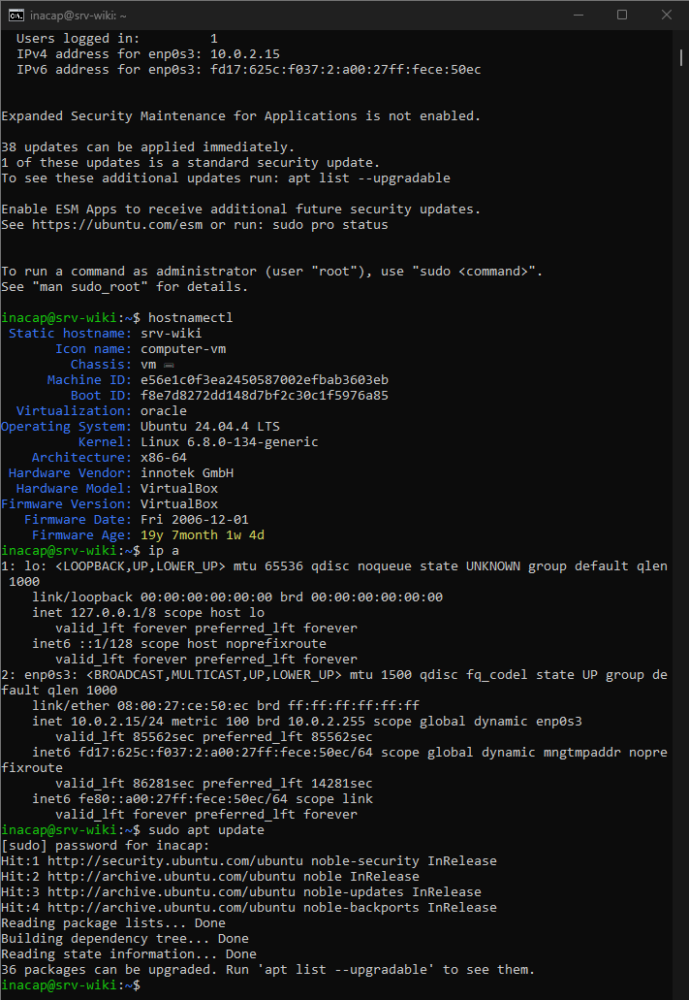

Luego se instalaron las actualizaciones disponibles:

```bash
sudo apt upgrade -y
```

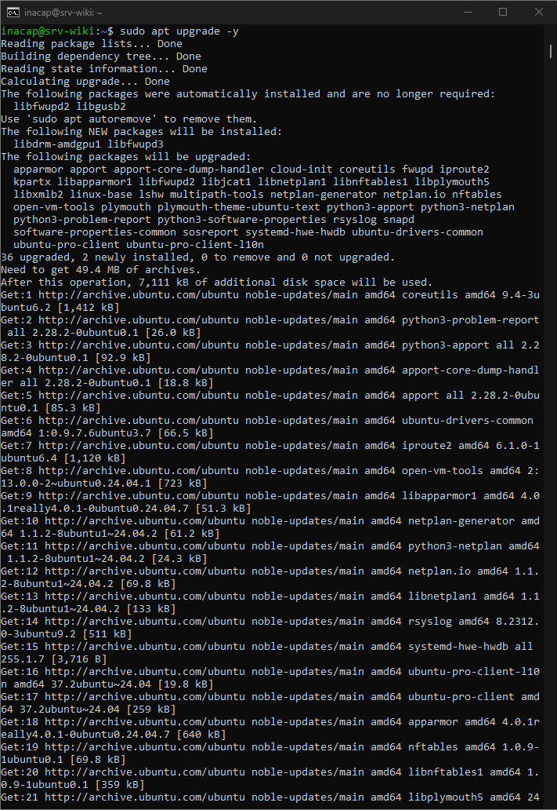

Con esto se mantuvo el sistema operativo actualizado.

---

## 8. Configuración del firewall UFW

Se autorizaron las conexiones SSH y el tráfico web:

```bash
sudo ufw allow OpenSSH
sudo ufw allow 80/tcp
sudo ufw enable
sudo ufw status verbose
```

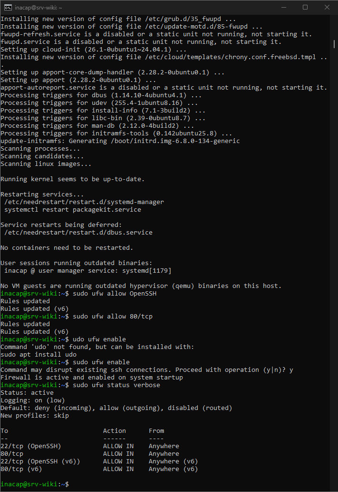

El firewall quedó activo con las siguientes reglas:

- Puerto `22/tcp` para OpenSSH.
- Puerto `80/tcp` para nginx.

---

## Resultado

La máquina virtual quedó configurada con:

- Ubuntu Server 24.04 LTS.
- Hostname `srv-wiki`.
- Usuario `inacap` con permisos mediante `sudo`.
- Red NAT con IP `10.0.2.15/24`.
- Acceso remoto por SSH.
- Sistema actualizado.
- Firewall UFW activo.
- Puertos SSH y web permitidos.

Con esto se completó el criterio 3.1.2 de instalación y configuración básica.
