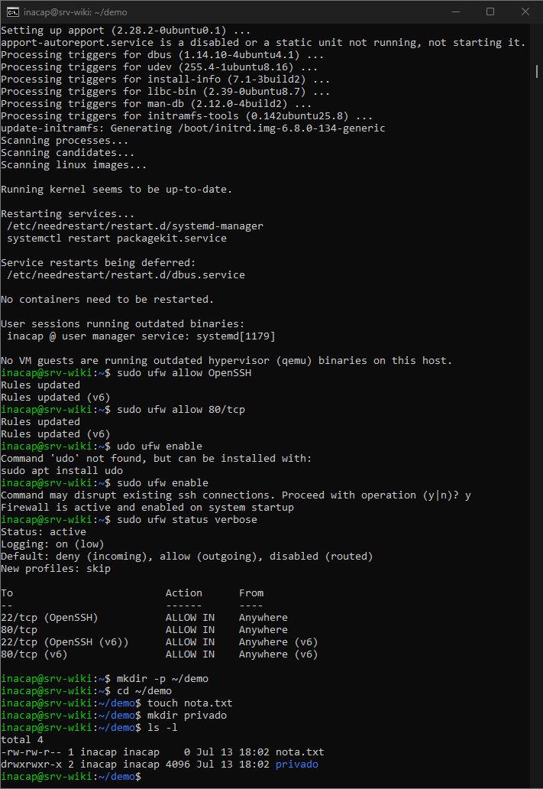
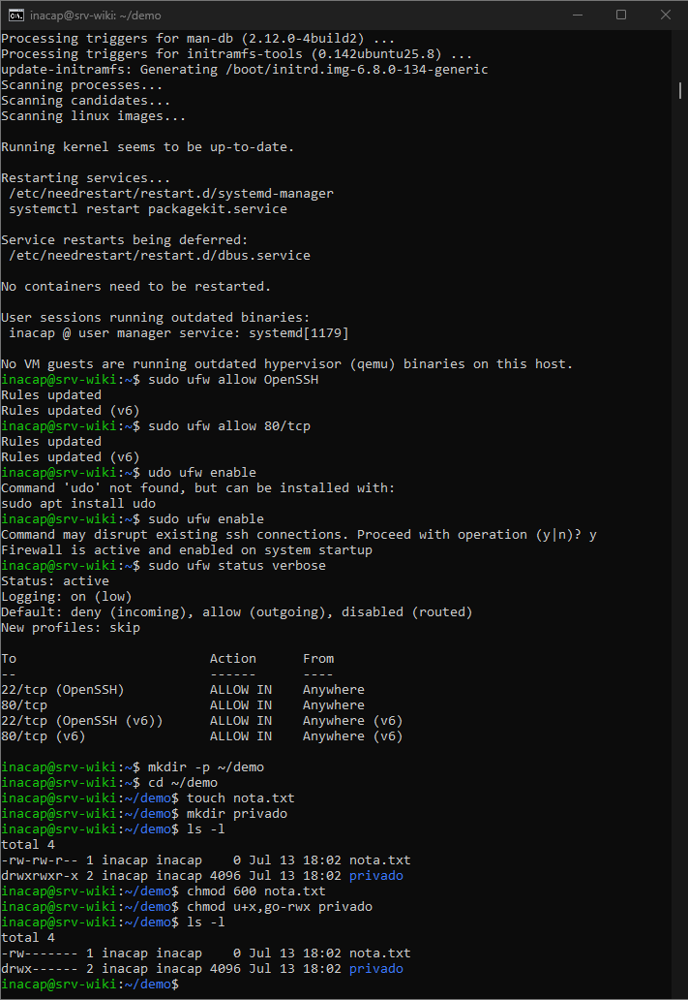
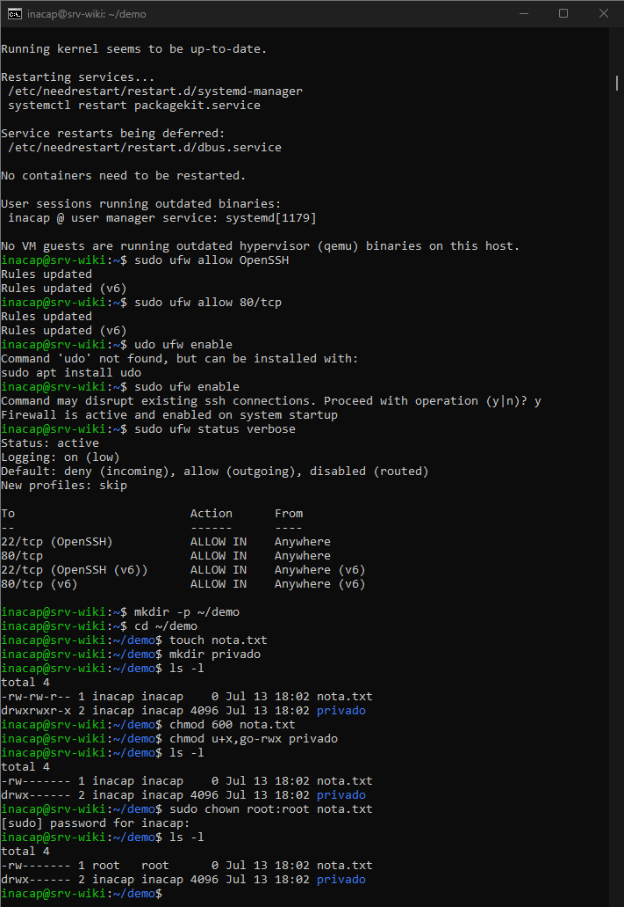
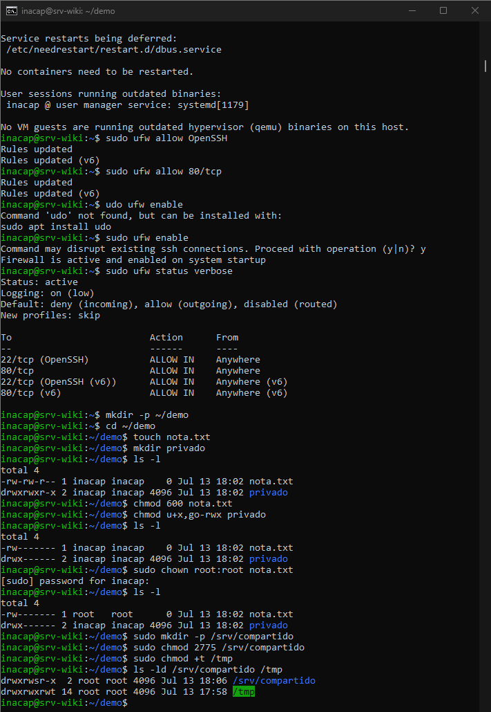

# Gestión de archivos y permisos en Linux

## Objetivo

Aplicar y verificar permisos básicos y especiales sobre archivos y directorios mediante comandos ejecutados desde la terminal.

---

## 1. Creación de archivos y revisión inicial

Se creó la carpeta `demo`, el archivo `nota.txt` y el directorio `privado`.

```bash
mkdir -p ~/demo
cd ~/demo
touch nota.txt
mkdir privado
ls -l
```



El comando `ls -l` mostró los permisos, el propietario y el grupo de cada elemento.

Los permisos se leen en tres grupos:

- Propietario.
- Grupo.
- Otros usuarios.

Por ejemplo, `-rw-rw-r--` indica que el propietario y el grupo pueden leer y escribir, mientras que los demás solo pueden leer.

---

## 2. Modificación de permisos con chmod

Se modificaron los permisos utilizando los modos numérico y simbólico.

```bash
chmod 600 nota.txt
chmod u+x,go-rwx privado
ls -l
```



`chmod 600 nota.txt` dejó el archivo con permisos de lectura y escritura solo para el propietario.

En el modo numérico:

- `r = 4`
- `w = 2`
- `x = 1`

Por lo tanto, `600` equivale a:

```text
rw-------
```

El comando `chmod u+x,go-rwx privado` aseguró permiso de ejecución para el propietario y eliminó todos los permisos del grupo y de otros usuarios.

---

## 3. Cambio de propietario y grupo con chown

Se cambió el propietario y grupo de `nota.txt` a `root`.

```bash
sudo chown root:root nota.txt
ls -l
```



El comando `chown` permite modificar el propietario y el grupo asociado a un archivo o directorio.

El resultado confirmó que `nota.txt` quedó asignado a:

```text
Propietario: root
Grupo: root
```

---

## 4. Aplicación de permisos especiales

Se creó el directorio `/srv/compartido` y se aplicaron los permisos especiales setgid y sticky bit.

```bash
sudo mkdir -p /srv/compartido
sudo chmod 2775 /srv/compartido
sudo chmod +t /tmp
ls -ld /srv/compartido /tmp
```



En `/srv/compartido` se aplicó `setgid`, representado por la letra `s`:

```text
drwxrwsr-x
```

Este permiso permite que los archivos y subdirectorios creados dentro hereden el grupo del directorio principal.

En `/tmp` se verificó el `sticky bit`, representado por la letra `t`:

```text
drwxrwxrwt
```

Este permiso evita que un usuario elimine archivos pertenecientes a otro usuario dentro de un directorio compartido.

El comando `ls -ld` muestra los permisos del directorio en sí, sin listar su contenido.

---

## Resultado

Al finalizar esta etapa se logró:

- Crear archivos y directorios desde la terminal.
- Interpretar permisos mediante `ls -l`.
- Modificar permisos con `chmod`.
- Utilizar los modos numérico y simbólico.
- Cambiar propietario y grupo mediante `chown`.
- Aplicar y verificar los permisos especiales setgid y sticky bit.

Con esto se completó el criterio 3.1.3 de gestión de archivos y permisos mediante línea de comandos.
