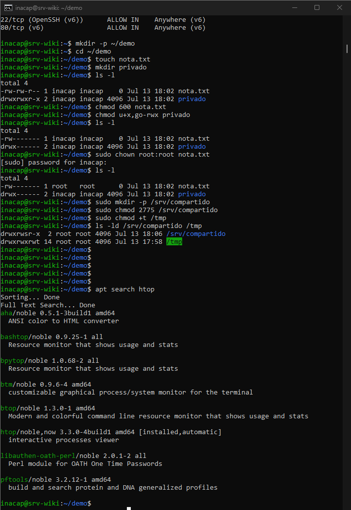
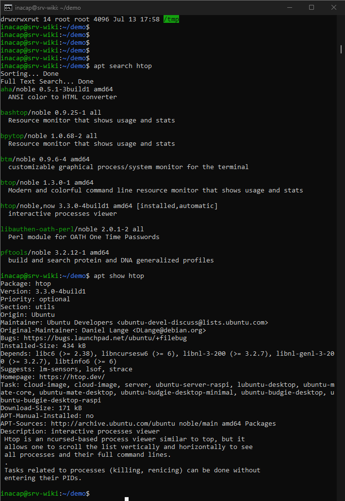
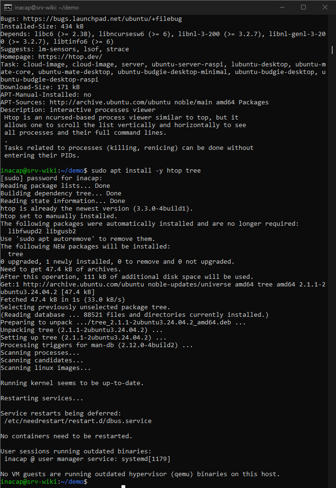
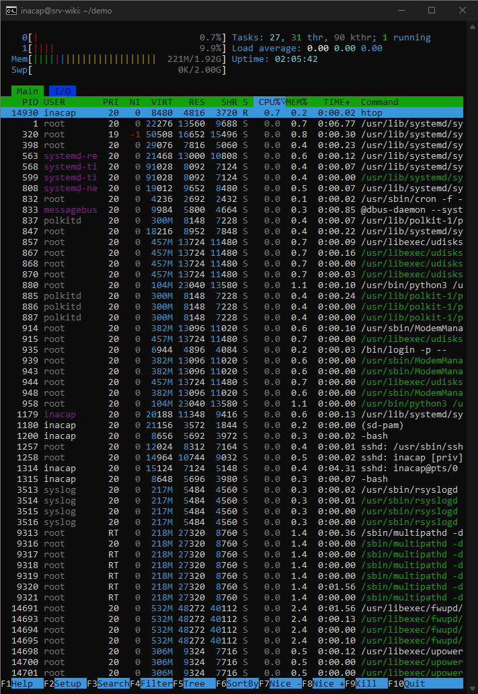
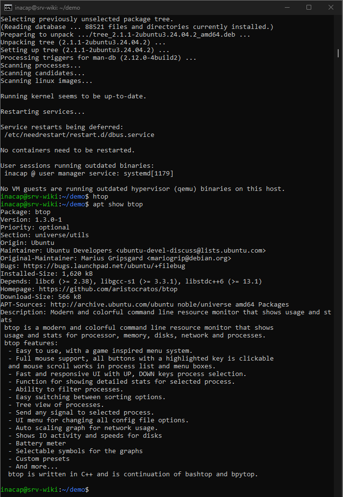
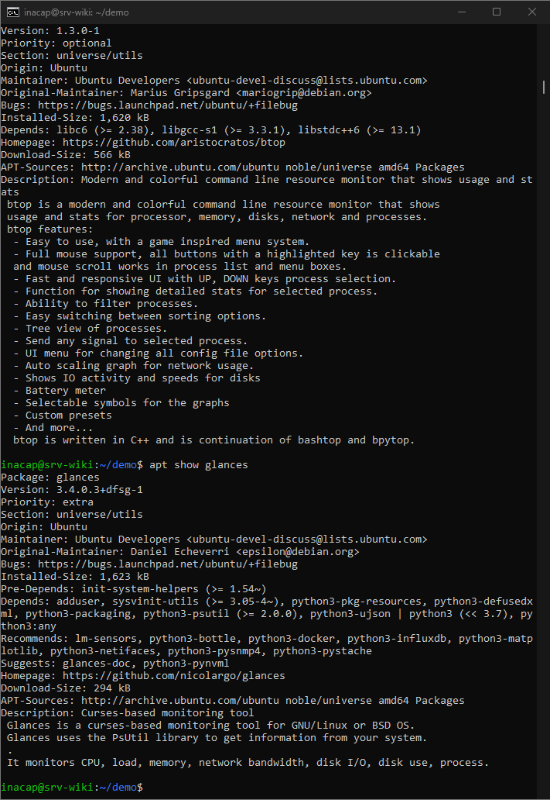

# Gestores de paquetes en Ubuntu Server

## Objetivo

Utilizar el gestor de paquetes `apt` para buscar, revisar e instalar herramientas, comparando alternativas según su tamaño, dependencias y utilidad.

---

## 1. Búsqueda del paquete htop

Se ejecutó:

```bash
apt search htop
```



El comando mostró los paquetes relacionados con `htop` disponibles en los repositorios de Ubuntu.

---

## 2. Revisión de información del paquete

Luego se consultaron sus detalles:

```bash
apt show htop
```



El resultado mostró su versión, tamaño, dependencias y descripción.

`htop` es un monitor interactivo de procesos que permite revisar el uso de CPU, memoria y los procesos activos desde la terminal.

---

## 3. Instalación de htop y tree

Se ejecutó:

```bash
sudo apt install -y htop tree
```



El sistema indicó que `htop` ya se encontraba instalado y actualizado. Además, instaló correctamente el paquete `tree`.

La opción `-y` permitió aceptar automáticamente la confirmación solicitada por `apt`.

---

## 4. Comprobación de htop

Para comprobar su funcionamiento se ejecutó:

```bash
htop
```



La interfaz mostró el uso de CPU, memoria, carga del sistema y los procesos en ejecución.

---

## 5. Comparación de alternativas

También se revisaron dos alternativas disponibles en los repositorios.

### btop

```bash
apt show btop
```



`btop` ofrece una interfaz más visual y muestra información de CPU, memoria, discos, red y procesos.

### glances

```bash
apt show glances
```



`glances` entrega un monitoreo más amplio del sistema, pero utiliza más dependencias que `htop`.

---

## Análisis de factibilidad

Se compararon las siguientes alternativas:

| Herramienta | Ventajas | Consideración |
|---|---|---|
| `htop` | Simple, liviana y fácil de usar | Menos funciones avanzadas |
| `btop` | Interfaz más visual y detallada | Puede consumir más recursos |
| `glances` | Monitoreo amplio del sistema | Requiere más dependencias |

Se eligió `htop` porque es una herramienta liviana, fácil de utilizar y suficiente para supervisar los recursos principales del servidor.

---

## Resultado

Al finalizar esta etapa se logró:

- Buscar paquetes con `apt search`.
- Revisar información con `apt show`.
- Instalar paquetes con `apt install`.
- Comprobar el funcionamiento de `htop`.
- Comparar alternativas antes de seleccionar una solución.

Con esto se completó la parte de gestores de paquetes del criterio 3.1.4.
