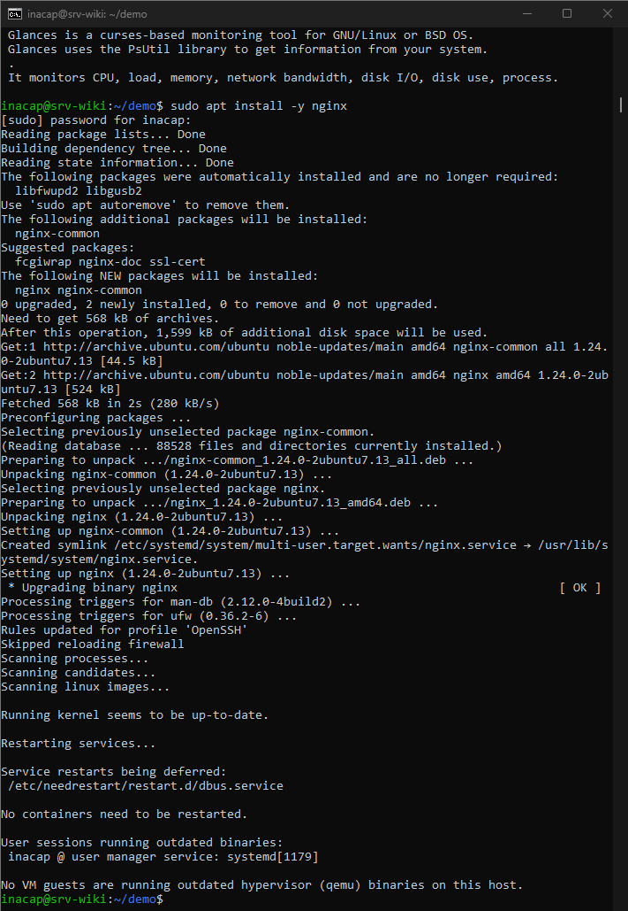
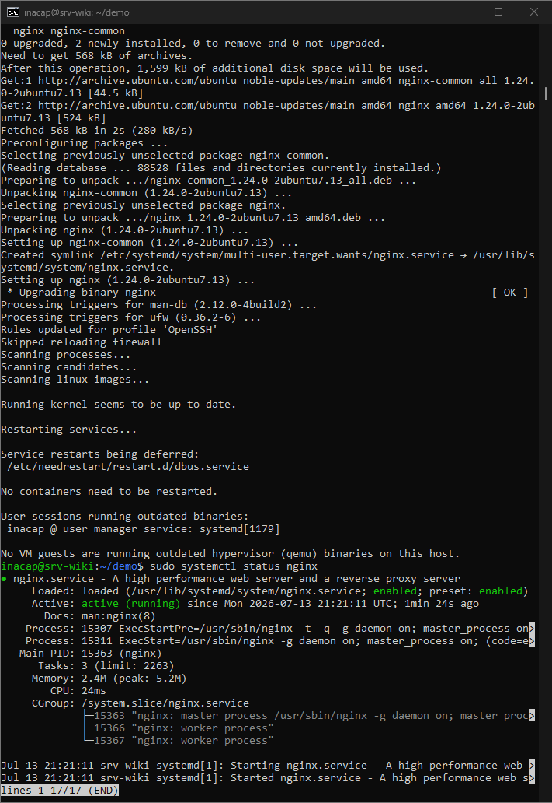
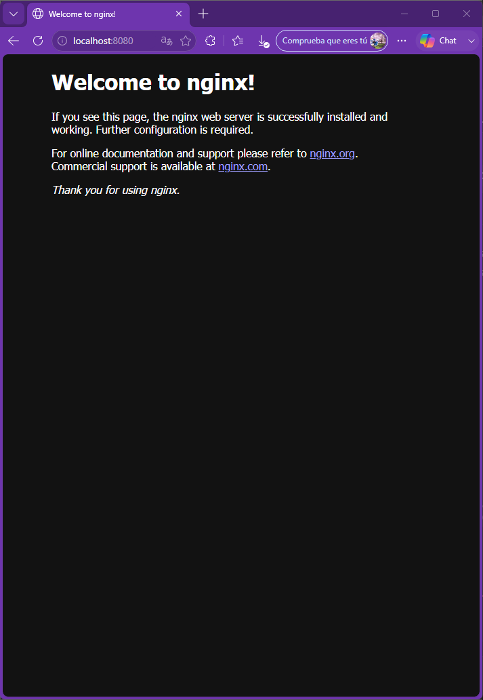
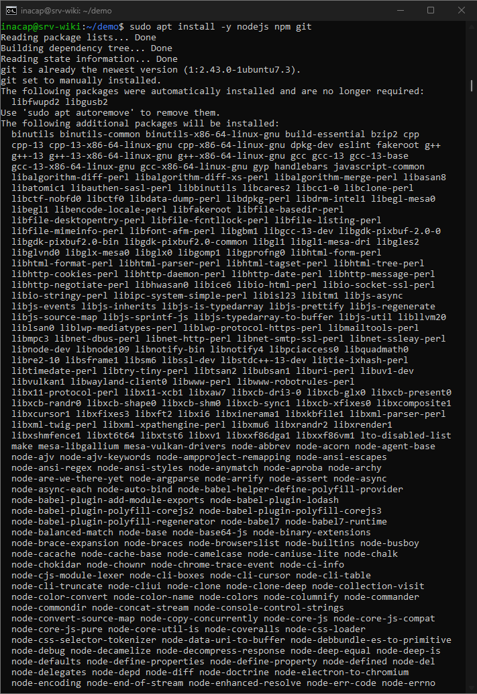
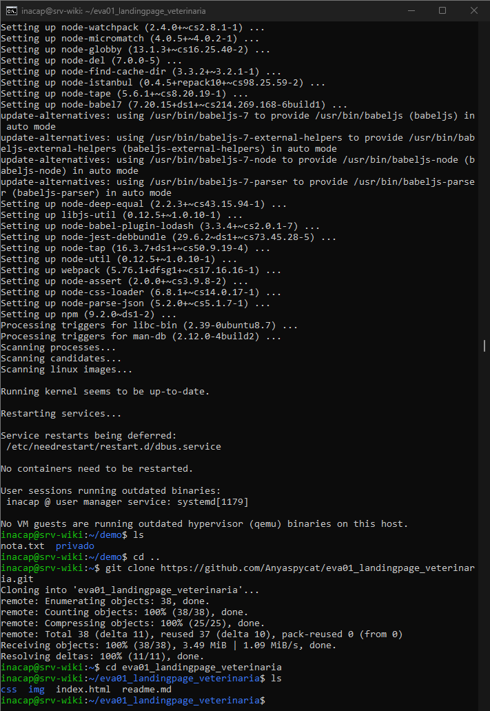
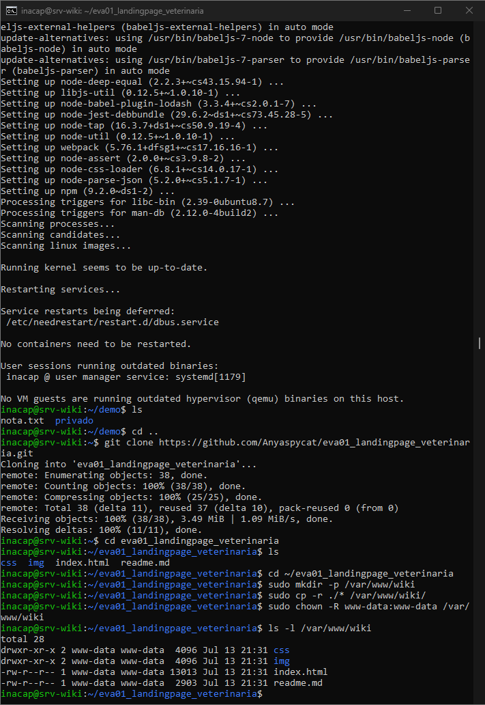
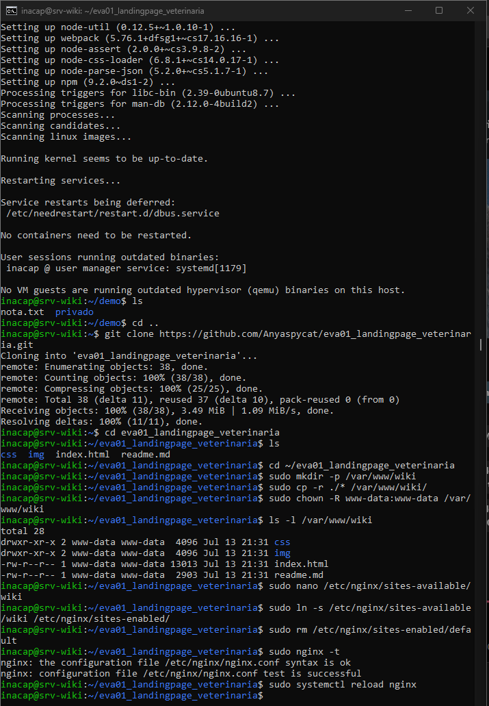
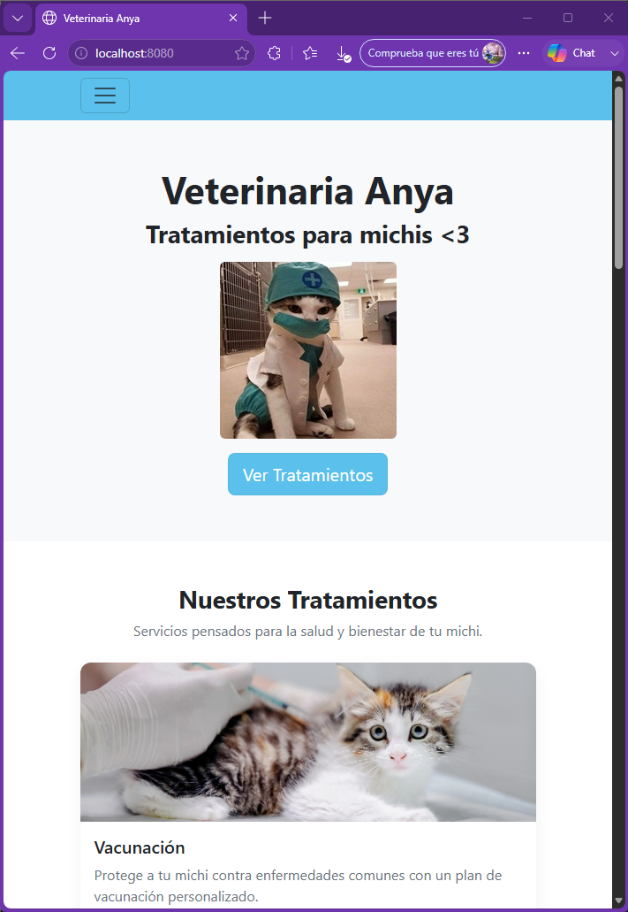

# Nginx y despliegue del sitio web

## Objetivo

Instalar y configurar nginx en Ubuntu Server para publicar un sitio web desde la máquina virtual y comprobar su acceso desde Windows mediante `localhost:8080`.

---

## 1. Instalación de nginx

Se instaló nginx con el siguiente comando:

```bash
sudo apt install -y nginx
```



La instalación terminó correctamente y el servicio quedó disponible en el servidor.

---

## 2. Verificación del servicio

Se comprobó el estado de nginx mediante:

```bash
sudo systemctl status nginx
```



El resultado mostró:

```text
Active: active (running)
```

Esto confirmó que nginx se encontraba iniciado y funcionando.

---

## 3. Página predeterminada de nginx

Desde Windows se abrió:

```text
http://localhost:8080
```



La página `Welcome to nginx!` confirmó que:

- nginx respondía por el puerto 80;
- UFW permitía el tráfico web;
- el reenvío `8080 → 80` de VirtualBox funcionaba correctamente.

---

## 4. Instalación de herramientas de apoyo

Se instalaron Node.js, npm y Git:

```bash
sudo apt install -y nodejs npm git
```



Git se utilizó para descargar el repositorio del portafolio. Node.js y npm quedaron disponibles para futuros proyectos que requieran construir una aplicación web.

---

## 5. Clonación del portafolio

Se clonó el repositorio:

```bash
git clone https://github.com/Anyaspycat/eva01_landingpage_veterinaria.git
```

Luego se verificó su contenido con:

```bash
ls
```



El repositorio contenía `index.html` y las carpetas `css` e `img`, por lo que podía publicarse directamente como sitio estático.

---

## 6. Copia del sitio y configuración de permisos

Se creó la carpeta del sitio y se copiaron los archivos:

```bash
sudo mkdir -p /var/www/wiki
sudo cp -r ./* /var/www/wiki/
sudo chown -R www-data:www-data /var/www/wiki
ls -l /var/www/wiki
```



El propietario y grupo de los archivos quedaron configurados como `www-data`, usuario utilizado por nginx para servir contenido web.

---

## 7. Configuración de nginx

Se creó el archivo:

```text
/etc/nginx/sites-available/wiki
```

con la siguiente configuración:

```nginx
server {
    listen 80 default_server;
    root /var/www/wiki;
    index index.html;

    location / {
        try_files $uri $uri/ /index.html;
    }
}
```

Luego se activó el sitio y se eliminó la configuración predeterminada:

```bash
sudo ln -s /etc/nginx/sites-available/wiki /etc/nginx/sites-enabled/
sudo rm /etc/nginx/sites-enabled/default
sudo nginx -t
sudo systemctl reload nginx
```



La validación mostró:

```text
syntax is ok
test is successful
```

Esto confirmó que el archivo de configuración no contenía errores.

---

## 8. Sitio publicado desde Ubuntu Server

Finalmente, se abrió nuevamente:

```text
http://localhost:8080
```



El portafolio reemplazó la página predeterminada de nginx y quedó servido desde la carpeta `/var/www/wiki` del servidor Ubuntu.

---

## Resultado

Al finalizar esta etapa se logró:

- Instalar nginx.
- Verificar el servicio activo.
- Comprobar el acceso mediante `localhost:8080`.
- Clonar un portafolio desde GitHub.
- Copiar el sitio a `/var/www/wiki`.
- Asignar propietario y grupo `www-data`.
- Configurar y validar nginx.
- Publicar correctamente un sitio web desde Ubuntu Server.

Con esto se completó la parte de nginx y despliegue correspondiente al criterio 3.1.4.
